# Tweeter Project

Tweeter is a simple, single-page Twitter clone.
Tweeter connects to a MongoDB to load tweets previously tweeted.
Tweeter will record and store tweet of at least 1 character and up to a maximum of 140 characters

## Getting Started

 Start the web server using the `npm run local` command. The app will be served at <http://localhost:8080/>.
 Go to <http://localhost:8080/> in your browser.

 You will be brought to the Tweet page:
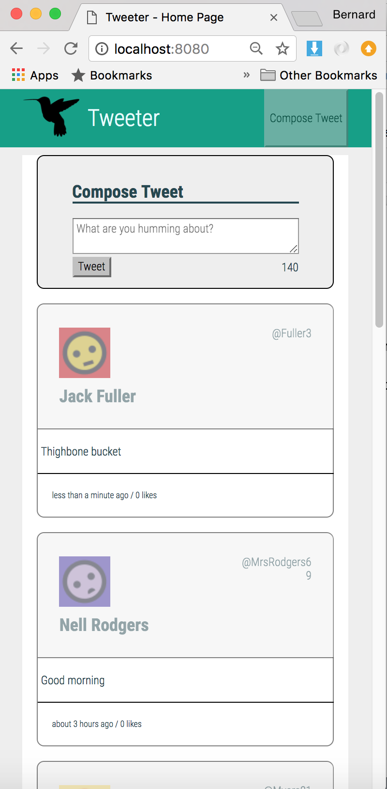

 There is a fixed header

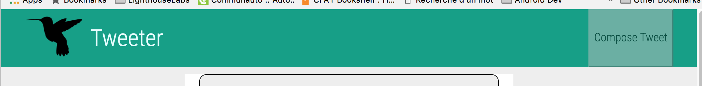

 with a "compose" button

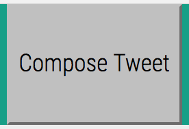

 A text entry box with a "tweet" button

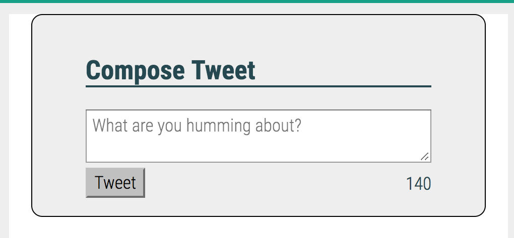

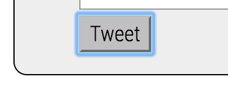

 A list of tweets that have been posted.

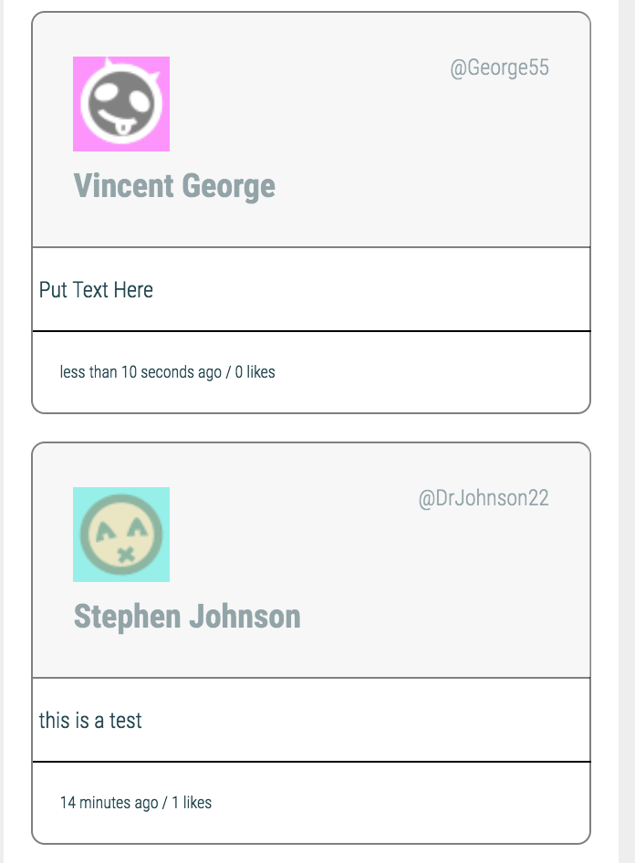

### Composing a Tweet

To compose a tweet enter text into the tweet text box

tweet text box img

NB: The "compose" button in the header will hide/display the Tweet box entry form. If the textbox is not visible, click the "compose" button then enter the tweet.

Note that there is a character countdown; a tweet must have at least one character and no more than 140 characters. Else an error will be flagged and the tweet will not post.

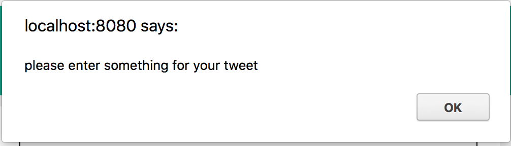
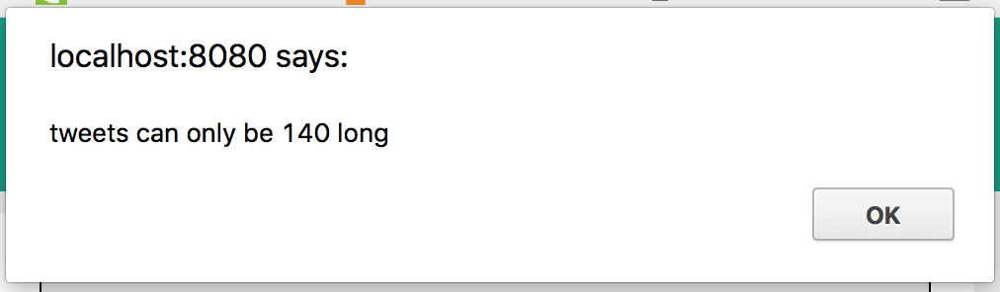

When over 140 characters have been entered a negative count begins to count up.

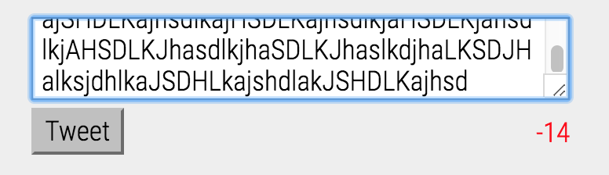

### Posting a Tweet

 A new tweet is posted after text is entered and the "tweet" button is pressed.

new tweet img

NB: The "compose" button in the header will hide/display the Tweet box entry form. If the textbox is not visible, click the "compose" button then enter the tweet and click the "tweet" button

 Tweets are auto refreshed after the tweet post. Posts are displayed in the order of the most recently posted tweet.

 Usernames are autogenerated

### Liking a Tweet

For any tweet in the list it is possible to like/unlike a Tweet.
To like/unlike a tweet of a posted tweet you must first hover over the tweet you want to like/unlike

When hovering over the tweet the Like button (heart) at the bottom of the tweet will appear

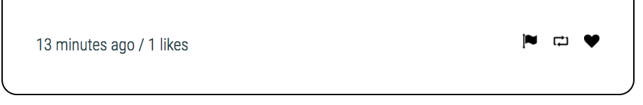

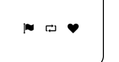

Then click on the like image to like/unlike. You will see the like counter count up/down depending on wether the user liked/unliked the tweet

## Dependencies

- Express 4.16.2
- Node 5.10.x or above
- MongoDB 2.2.33
- Body-Parser 1.18.2
- NodeMon 1.9.2
- Node-Sass-Middleware 0.11.0
- Chance 1.0.11

